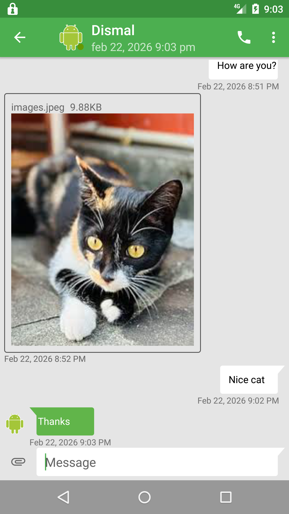
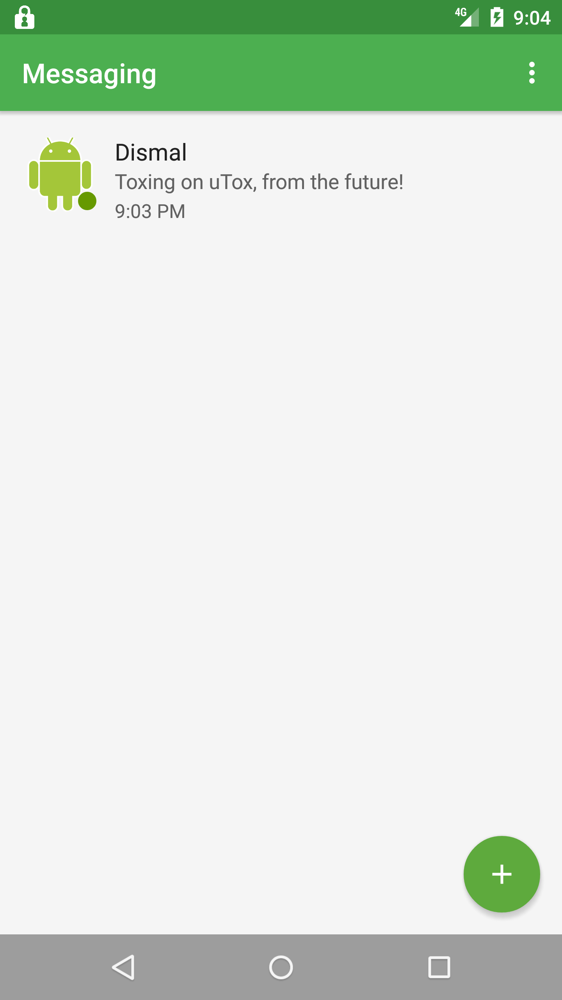

# bTox


The reasonable Tox client for Android based on aTox with new feature.

 

## New Features
- Ability to change profile photo
- New AOSP based UI
- App password or option to use screen lock
## Building

### Clone!

`git clone https://github.com/dismal002/bTox.git`

### Build tox4j!

Until [#730][publish-tox4j] is closed, you'll have to build and publish tox4j to a local repository:

```sh
./scripts/build-host -j$(nproc)
./scripts/build-aarch64-linux-android -j$(nproc) release
./scripts/build-arm-linux-androideabi -j$(nproc) release
./scripts/build-i686-linux-android -j$(nproc) release
./scripts/build-x86_64-linux-android -j$(nproc) release
```

### Build bTox!

`gradlew build`
